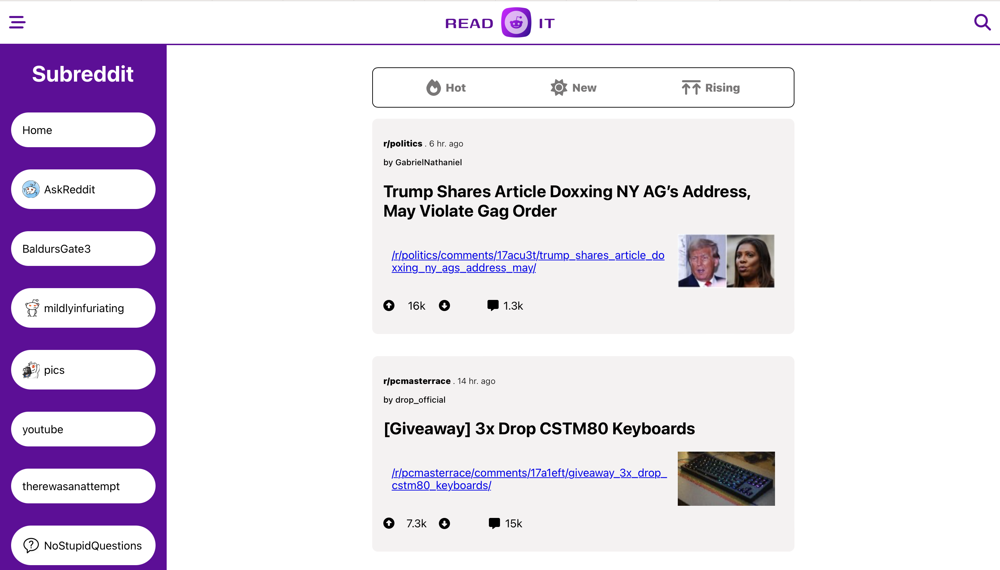
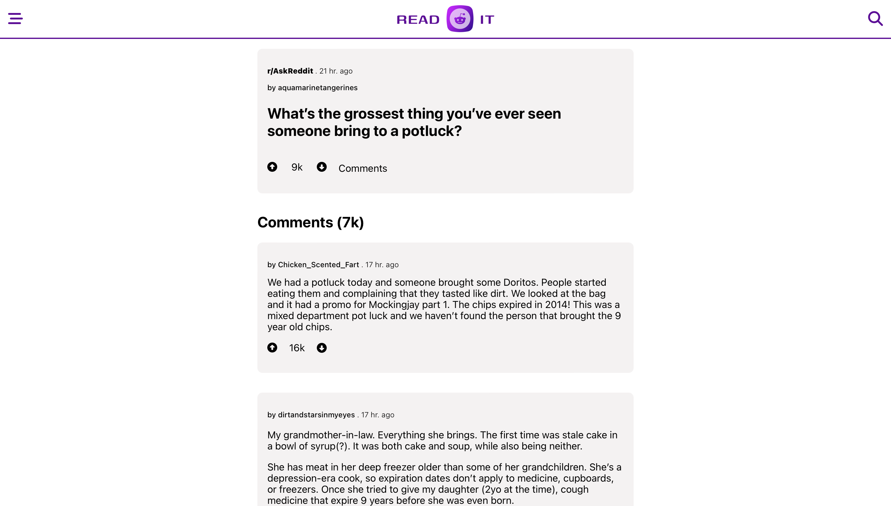

# READ IT

READ IT is a minimalistic Reddit.com clone project build using Reddit JSON API. With READ IT, you can view posts and media, filter posts, explore popular subreddits, and search for specific subreddits. This web application was built using React/Redux, providing a seamless and user-friendly experience. A live demo can be found [here](https://readit-reddit.netlify.app).

## Tech Stack

* HTML
* CSS
* JavaScript
* React
* Redux
* Git and GitHub
* Command line and file navigation

## Screenshots

### Homepage Design

### Comments Page Design

## Features

* Stripped of all human to human interactions - You consume content, not create it.
* Post feed browsing by popular subreddits and sections (hot, new and rising).
* Search bar to find posts by specific terms.
* Unique view for any post and its comments.
* Responsive layout that adapts to different screen sizes.